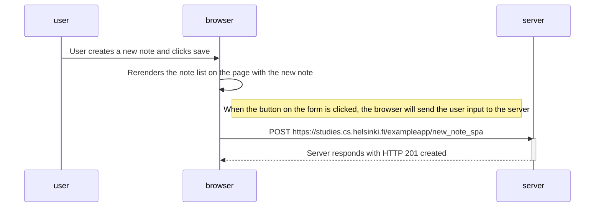

```mermaid
sequenceDiagram
    participant user
    participant browser
    participant server

    user->>browser: User creates a new note and clicks save

    browser->>browser: Rerenders the note list on the page with the new note

    Note right of browser: When the button on the form is clicked, the browser will send the user input to the server

    browser->>server: POST https://studies.cs.helsinki.fi/exampleapp/new_note_spa
    activate server
    server-->>browser: Server responds with HTTP 201 created
    deactivate server


```
